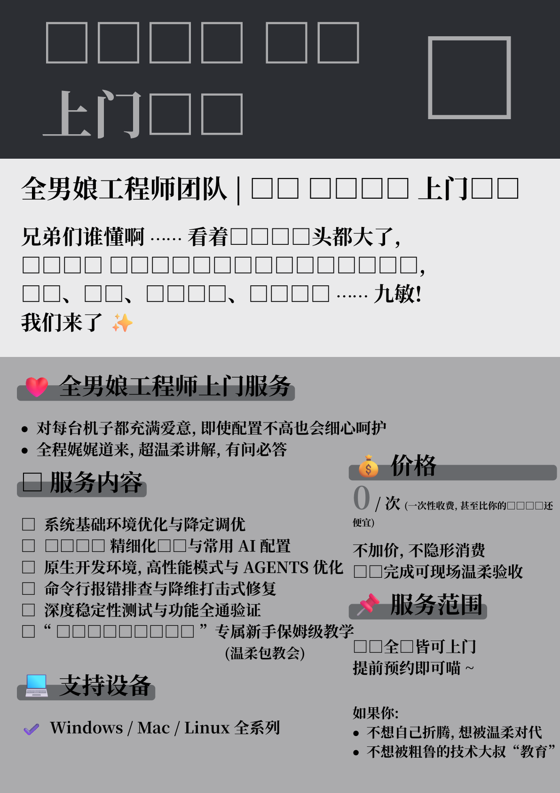

# OS Install

"上门安装" 海报生成与收集仓库. 

"上门安装" poster generation and collection repository. 

## 例子 ⊢ Examples

|  |  |
| - | - |
|  |  |
|  |  |
|  |  |

## 贡献 ⊢ Contributing

### 环境 ⊢ environment

1. 确保本地安装了 [Noto Serif CJK SC][noto-cjk] 或等效字体 \
  Ensure that [Noto Serif CJK SC][noto-cjk] or an equivalent font is installed locally

1. 确保本地安装了 [Typst] 命令行工具 \
  Ensure that the [Typst] command-line tool is installed locally

1. 确保本地安装了 [Segoe Fluent Emoji 3D][segoeemj] 或等效字体 \
  Ensure that [Segoe Fluent Emoji 3D][segoeemj] or an equivalent font is installed locally

在仓库根目录执行以下命令

Execute the following command in the root directory of this repository

```typ
typst c typst.typ typst.new.png
```

检查文件 `typst.new.png` 和 `typst.png` 是否一致. 

Check whether the files `typst.new.png` and `typst.png` are consistent. 

[noto-cjk]: https://github.com/notofonts/noto-cjk
[typst]: https://github.com/typst/typst
[segoeemj]: https://tetunori.github.io/fluent-emoji-webfont/dist/FluentEmojiColor.ttf

### 约定 ⊢ Convention

海报的非主文件内容需放入主文件同名无后缀文件夹. 

The non-main file content of the poster needs to be placed in a folder with the same name as the main file but without a suffix. 

## 许可 ⊢ License

本项目采用 ["知识署名—非商业性使用—相同方式共享 4.0 协议国际版"][cc-by-nc-sa-zh] 进行许可。

This repository is licensed under a [Creative Commons Attribution-NonCommercial-ShareAlike 4.0 International License][cc-by-nc-sa-en].

[cc-by-nc-sa-zh]: https://creativecommons.org/licenses/by-nc-sa/4.0/deed.zh-hans

[cc-by-nc-sa-en]: https://creativecommons.org/licenses/by-nc-sa/4.0/deed.en
